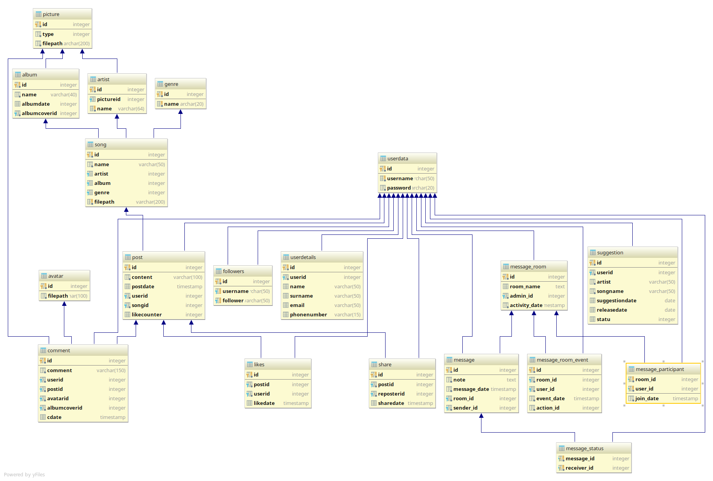

Developer Guide
===============

Database Design
---------------

      Er diagram of the database

* This project developed using  postgresql as database mamagement system.
* Nineteen tables implemented for this project.

Code
----

* This project based on object-oriented programming using python flask framework.

* We use data access objects for ensuring layered structure for application.

* We use templates and bootstrap framework for better design.

.. toctree::

   member1
   member2
   member3
   member4
   member5
