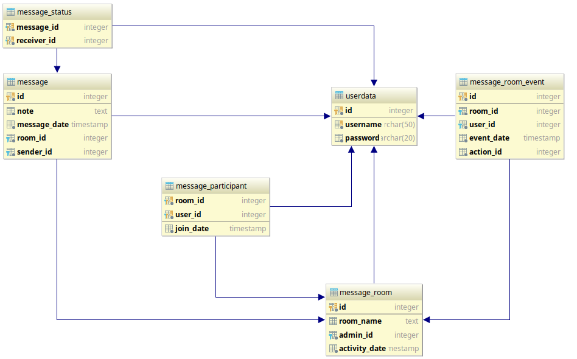

===================================
Parts Implemented by Serkan Suyabak
===================================

.. contents:: Contents
   :local:

***************
Database Design
***************

E/R diagram of related tables
=============================

Initialization of tables
========================

.. py:function:: init_database.drop_messages_table()

   Drops related tables if they exist

.. code-block:: python
   :linenos:

       def drop_messages_table():
        with dbapi2.connect(dsn) as connection:
            with connection.cursor() as cursor:
                cursor.execute(
                        """ DROP TABLE IF EXISTS message_room CASCADE;
                            DROP TABLE IF EXISTS message CASCADE;
                            DROP TABLE IF EXISTS message_participant;
                            DROP TABLE IF EXISTS message_status;
                            DROP TABLE IF EXISTS message_room_admins;
                            DROP TABLE IF EXISTS message_room_event; """)

.. py:function:: init_database.create_messages_table()

   Creates related tables

.. code-block:: python
   :linenos:

       def create_messages_table():
        """ Drops(if exits) and Creates all tables for Messages """
        with dbapi2.connect(dsn) as connection:
            with connection.cursor() as cursor:
                cursor.execute(
                    """
                        CREATE TABLE
                          message_room (
                           id             SERIAL    PRIMARY KEY,
                           room_name      TEXT      NULL,
                           admin_id       INTEGER   NOT NULL REFERENCES USERDATA(ID) ON DELETE CASCADE,
                           activity_date  TIMESTAMP NOT NULL  DEFAULT CURRENT_TIMESTAMP
                          );

                        CREATE TABLE
                          message (
                            id            SERIAL    PRIMARY KEY,
                            note          TEXT      NOT NULL,
                            message_date  TIMESTAMP NOT NULL   DEFAULT CURRENT_TIMESTAMP,
                            room_id       INTEGER   NOT NULL   REFERENCES message_room(id) ON DELETE CASCADE,
                            sender_id     INTEGER   NOT NULL   REFERENCES USERDATA(ID) ON DELETE CASCADE
                          );

                        CREATE TABLE
                          message_participant (
                            room_id       INTEGER   NOT NULL   REFERENCES message_room(id) ON DELETE CASCADE,
                            user_id       INTEGER   NOT NULL   REFERENCES USERDATA(ID) ON DELETE CASCADE,
                            join_date     TIMESTAMP NOT NULL   DEFAULT CURRENT_TIMESTAMP,
                            PRIMARY KEY (room_id, user_id)
                          );

                        CREATE TABLE
                          message_status (
                            message_id    INTEGER   NOT NULL   REFERENCES message(id) ON DELETE CASCADE,
                            receiver_id   INTEGER   NOT NULL   REFERENCES USERDATA(ID) ON DELETE CASCADE,
                            PRIMARY KEY (message_id, receiver_id)
                          );

                        CREATE TABLE
                          message_room_event (
                            id            SERIAL    PRIMARY KEY,
                            room_id       INTEGER   NOT NULL   REFERENCES message_room(id) ON DELETE CASCADE,
                            user_id       INTEGER   NOT NULL   REFERENCES USERDATA(ID) ON DELETE CASCADE,
                            event_date    TIMESTAMP NOT NULL   DEFAULT CURRENT_TIMESTAMP,
                            action_id     INTEGER   NOT NULL
                          ); """
                )

* message_room: line 7 - 13
   In this table, i stored room name as text and admin_id as integer. admin_id references userdata table and determines who is the admin.
   activity_date is timestamp value and it gives us the last message date of the room. The last message date value of each room can be derived
   from other tables, but additionally keeping this value makes things easier and faster.

* message: line 15 - 22
   This table stores necessary information of one message like what it say, who sends it, when it send, send to which room.

* message_participant: line 24 - 30
   This table stores room_id and user_id pairs that specify who is in which room. Also it stores joining date for blocking participant to reach
   older messages. The primary key is pair of room_id and user_id.

* message_status: line 32 - 37
   To determine a message is read by all participants, when a message is send, every participants that found in the
   room and new message_id are stored in this table. If the user read this message, related entry will be deleted. So, if there is an entry for
   a message, it means that the message is not read by all participants. otherwise it means the message is read by all.  (see :ref:`Read_Receipts`)

* message_room_event: line 39 - 46
   This table stores all information about room events. action_id determines type of events. user_id determines who is
   related with this event and room_id shows that in which room this event occurred. (see :ref:`Room_Events`)

**************
Python Objects
**************

Room
====

Summary of Room Class:

.. py:class:: Room

   Contains all variables and methods about related message room.

   .. py:attribute:: id

      Database id of the room

   .. py:attribute:: name

      Name of the room. Can be None (null value)

   .. py:attribute:: admin

      Userdata object. Contains information like username, password, if of user. The admin user.

   .. py:attribute:: participants

      The list of Userdata objects. List contains participants of room.

   .. py:attribute:: items

      The list of messages and events. The list contains Message objects and Event objects. Messages and events are combined, because they are
      shown at same place and will be sorted with their date.

   .. py:attribute:: unread_count

      Stores unread message count in this room.

   .. py:attribute:: last_message

      Store first 60 character of last message of this room.

Message
=======

.. py:class:: Message

   Contains all variables and methods about related message.

   .. py:attribute:: id

      Database id of the message.

   .. py:attribute:: sender

      Userdata object. Sender of the message.

   .. py:attribute:: room_id

      Integer value. Determines that this message is belongs to which room.

   .. py:attribute:: text

      The content of the message. String value.

   .. py:attribute:: date

      Sending date of the message.

   .. py:attribute:: isRead

      Boolean value that whether this message is read by other participants or not.

Event
=====

.. py:class:: Event

   Contains all variables and methods about related message room.

   .. py:attribute:: id

      Database id of the event.

   .. py:attribute:: room_id

      Integer value. Determines that this event is belongs to which room.

   .. py:attribute:: user

      Userdata object. Shows that which participants do this event.

   .. py:attribute:: action

      Events(enum) object. Determines type of the event

   .. py:attribute:: date

      Date of the event.

   .. py:attribute:: text

      Display value of that action.

.. py:class:: Events(enum)

   Enum values of events. value 0 for Join event, value 1 for Left event, value 2 for Admin event.

*******************
Database Operations
*******************

Room Operations
===============

.. _list_rooms:

Listing Rooms
-------------

To get all room headers (room name, last message and unread message count), there is a static method for Room class:

.. py:staticmethod:: get_room_headers([text=None])

   :params text: Search text that search participants. To get all room headers, may left as None.
   :return: List of Room objects that current user participated.

.. code-block:: python
   :linenos:

       @staticmethod
       def get_headers(text=None):
           """ Load All Room Headers of User participated"""
           rooms = []

First initialize rooms empty list

.. code-block:: python
   :lineno-start: 5

           with dbapi2.connect(dsn) as connection:
               with connection.cursor() as cursor:
                   cursor.execute("""

Connect to db, start transaction

.. code-block:: postgresql
   :lineno-start: 8

                     SELECT id, room_name, activity_date, msg.unread_cnt, participant.participants, messages.note
                       FROM message_room

We have all rooms, for now.

.. code-block:: postgresql
   :lineno-start: 10

                         RIGHT JOIN ( SELECT room_id
                                        FROM message_participant
                                        WHERE user_id = %(user_id)s ) AS rooms
                           ON message_room.id = rooms.room_id

And we right joined all rooms to room_id (all room ids that current user participated). So we have all rooms that current user participated.

.. code-block:: postgresql
   :lineno-start: 14

                         LEFT JOIN ( SELECT COUNT(*) AS unread_cnt, message.room_id AS mid
                                       FROM message_status
                                         JOIN message
                                           ON message_status.message_id = message.id
                                           AND message_status.receiver_id = %(user_id)s
                                       GROUP BY message.room_id ) AS msg
                           ON msg.mid = message_room.id

We have add unread_count information to rooms. At line 15 - 18, we have only messages that current user haven't read yet. And line 19 we grouped by
room_id. So we can select unread message count by count(*) for every room. We left join this to rooms to add this information to rooms,

.. code-block:: postgresql
   :lineno-start: 21

                         LEFT JOIN ( SELECT ARRAY_AGG(user_id) AS participants, room_id
                                       FROM message_participant
                                       GROUP BY room_id ) AS participant
                           ON participant.room_id = message_room.id

We need participants to show Room name if room name doesn't exist. This join operation is not needed if the room has a name. But checking is in
the sql, makes this code more complicated. Anyway, i fetched the participants list of each room. For this operation, all participants grouped by
room_id s and user_id s of participants aggregated in array. So until this point we have room_id and participants array. After the left joined
this, we can add participants information to room list.

.. code-block:: postgresql
   :lineno-start: 25

                         LEFT JOIN ( SELECT message.room_id, message.note
                                       FROM ( SELECT room_id, MAX(message_date) AS latest
                                                FROM message
                                                  GROUP BY room_id ) AS m
                                         INNER JOIN message
                                           ON message.room_id = m.room_id and message.message_date = m.latest  ) AS messages
                           ON messages.room_id = message_room.id
                           """, { 'user_id': current_user.id })

At last, we need last message of each room. To achieve this, we need message table join to itself. In first message table (line 26 - 28), we grouped
messages by room_id and found MAX(message_date) of each group. We can't get message.note from first table. So we need to join to find message
with same room_id and same message_date. And we need only room.id and message.note. After the left join these information, we have added last
message information to rooms

.. code-block:: python
   :lineno-start: 32

                      result = cursor.fetchall()

                   for res in result:
                       room = Room(name=res[1])
                       room.id = res[0]
                       room.last_message_date = res[2]
                       room.unread_count = res[3]
                       room.participants = [get_user_by_id(pid) for pid in res[4]]
                       room.last_message = res[5][:60] if res[5] is not None else ""
                       if text is not None:
                           for p in room.participants:
                               if p.username.startswith(text):
                                   rooms.append(room)
                                   continue  # error: it should be break!
                       else:
                           rooms.append(room)

           return rooms

After the fetching information, these lines create Room objects.

.. _Search_User:

At line 41, if the given parameter is not None, then we look participants to find anyone of them has a name that starts with given parameter. I
realize that i did a mistake at time of writing this. Instead of continue to looking a participant after the finding a match at line 45, i should
break loop to prevent to add repeated rooms.

Searching User
^^^^^^^^^^^^^^

To list of rooms that have at least one participant which its name starts with given text, the text should be given as
parameter to get_room_headers() method of Room class. See :ref:`list_rooms`

Creating New Room
-----------------

To create new message room, first create Room object and then call create() method.

.. code-block:: python
   :linenos:

   Messages.Room(name=room_name, admin=admin_user, participants=[list of participants]).create()

.. py:method:: create()

   Insert current room information to database.

   :returns: new id

.. code-block:: python
   :linenos:

   def create(self):
      if self.id is not None or self.admin is None:  # if id is not none it has been in db already
         return

      if len(self.participants) == 2:
         rid = Room.get_room_id_with(self.participants[0].id if self.participants[1].id == current_user.id
                                     else self.participants[1].id)
         if rid is not None:
             return rid

      # create room in db
      with dbapi2.connect(dsn) as connection:
         with connection.cursor() as cursor:
             cursor.execute(
                 """ INSERT
                       INTO message_room ( id, room_name, admin_id )
                       VALUES ( DEFAULT, %(room_name)s, %(admin_id)s )
                       RETURNING id """, {
                     'room_name': self.name,
                     'admin_id': self.admin.id
                 })

             self.id = cursor.fetchone()[0]

      self.update_participants()
      Event(self.id, self.admin, Events.ADMIN).create()

      return self.id

* At line 2: i have checked whether the room already have been in database.
* At line 5 - 9: if room has only two participants and these two participants have already a conversation, we return old room instead of creating new one.
* At line 12 - 23: Inserting new values of room.
* At line 25: Adding Participants (see :ref:`Participants`)
* At line 26: Creating Admin Event. (see :ref:`Create_Event`)

.. _Participants:

Participants
------------

.. py:method:: update_participant([participants=None])

   Updates participants of room.

   :params list participants: New participants list. if it is None, then current participants will be inserted to database.

.. code-block:: python
   :linenos:

   def update_participants(self, participants=None):
     if participants is None:  # ilk kayit.
         participants = self.participants
         self.participants = []

     old_ids = set([p.id for p in self.participants])
     new_ids = set([p.id for p in participants])

     for deleted in self.participants:  # eski listede olup yeni listede olmayan
         if deleted.id not in new_ids:
             self.remove_participant(deleted)

     for added in participants:  # eski listede olmayip yeni listede olan
         if added.id not in old_ids:
             self.add_participant(added)

* At line 2: if parameter is not given, that means room is newly created and new participants should be old participants, old participants should
  be empty list.
* At line 9 - 11: if a participant is in old list but not in new list, then removed this user. (see :ref:`addparticipant` )
* At line 12 - 14: if a participant is not in old list but in new list, then add this user. (see :ref:`removeparticipant` )

.. _addparticipant:

Adding Participant
^^^^^^^^^^^^^^^^^^

.. py:method:: add_participant(participant)

   Add given User as participant to room.

.. code-block:: python
   :linenos:

   def add_participant(self, participant):
       with dbapi2.connect(dsn) as connection:
           with connection.cursor() as cursor:
               cursor.execute(
                   """ INSERT
                         INTO message_participant ( room_id, user_id )
                         VALUES ( %(room_id)s, %(user_id)s )""", {
                       'room_id': self.id,
                       'user_id': participant.id
                   })

               self.participants.append(participant)
               Event(self.id, participant, Events.JOIN).create()

* Insert to database and create Join event. (see :ref:`create_event`)

.. _removeparticipant:

Removing Participant
^^^^^^^^^^^^^^^^^^^^

.. py:method:: remove_participant(participant)

   Remove participant from the room.

   :params Userdata participant: Participant that will be removed.

.. code-block:: python
   :linenos:

   def remove_participant(self, participant):
       self.read_all(participant)
       with dbapi2.connect(dsn) as connection:
           with connection.cursor() as cursor:
               cursor.execute(
                   """ DELETE
                         FROM message_participant
                         WHERE room_id = %(room_id)s
                           AND user_id = %(user_id)s """, {
                       'room_id': self.id,
                       'user_id': participant.id
                   })

               self.participants.remove(participant)
               Event(self.id, participant, Events.LEFT).create()

               # check admin
               if self.admin.id == participant.id:
                   self.update_admin(self.participants[0])

* At line 2: Remove all waiting messages for this user read. (see :ref:`Read All <readall>`)
* At line 3 - 14: Remove participant from Database and list
* At line 15: Create Left event (see :ref:`create_event` )
* At line 17 - 19: If the removed participant is the admin of the room, then update admin of the room. (see :ref:`updateadmin`)

.. _readall:

.. py:method:: read_all(user)

   Delete all waiting message status entry for given user and this room.

   :params user: A userdata object.

.. code-block:: python
   :linenos:

   def read_all(self, user):
       with dbapi2.connect(dsn) as connection:
           with connection.cursor() as cursor:
               cursor.execute(
                   """ DELETE
                         FROM message_status
                         WHERE receiver_id = %(user_id)s
                           AND message_id = ANY( SELECT id
                                                   FROM message
                                                   WHERE room_id = %(room_id)s ) """, {
                       'user_id': user.id,
                       'room_id': self.id
                   })

* Delete all entries in message_status table where message_id is equal to one of the messages in this room and receiver_id is equal to given user_id

.. _updateadmin:

Update Admin of Room
--------------------

.. py:method:: update_admin(user)

   Makes given user Admin of the room.

   :params Userdata user: New Admin

.. code-block:: python
   :linenos:

   def update_admin(self, user):
       with dbapi2.connect(dsn) as connection:
           with connection.cursor() as cursor:
               cursor.execute(
                   """ UPDATE message_room
                         SET admin_id = %(admin_id)s
                         WHERE id = %(room_id)s """, {
                       'room_id': self.id,
                       'admin_id': user.id
                   })
               self.admin = user
               Event(self.id, user, Events.ADMIN).create()

* Set new Admin of room the given user.
* At line 12: Create Admin event (see :ref:`create_event`)

Room Name
---------

.. py:method:: update_name(name)

   Updates name of the room

   :params name: New name of the room. May be None.

.. code-block:: python
   :linenos:

   def update_name(self, name):
       self.name = name.strip() if name is not None and len(name.strip()) > 0 else None
       with dbapi2.connect(dsn) as connection:
           with connection.cursor() as cursor:
               cursor.execute(
                   """ UPDATE message_room
                         SET room_name = %(room_name)s
                         WHERE id = %(id)s """, {
                       'id': self.id,
                       'room_name': self.name
                   })

* At line 2: check new name whether is valid or not
* Update database

Leaving Room
------------

To leave room, first remove current participant from participants list of the room and call update_participants() method. (see :ref:`participants`)

Deleting Room
-------------

.. py:method:: delete()

   Deletes room and all related entries

.. code-block:: python
   :linenos:

   def delete(self):
       with dbapi2.connect(dsn) as connection:
           with connection.cursor() as cursor:
               cursor.execute(
                   """ DELETE
                         FROM message_room
                         WHERE id = %(id)s""", {
                       'id': self.id
                   })

* Removing entry from message_room table cause removing of all other entries with connected this entry via foreign key.

Message Operations
==================

Sending Message
---------------

.. py:method:: send_message(content)

   Creates Message Object and save it.

   :params content: Content of the message

.. code-block:: python
   :linenos:

   def send_message(self, content):
       if content is not None and len(content.strip()) > 0:
           Message(current_user, self.id, content.strip()).create()
           self.activate()

.. py:method:: activate()

   Updates last activity date of the room.

.. code-block:: python
   :linenos:

   def activate(self):
       with dbapi2.connect(dsn) as connection:
           with connection.cursor() as cursor:
               cursor.execute(
                   """ UPDATE message_room
                         SET activity_date = %(activity_date)s
                         WHERE id = %(id)s """, {
                       'id': self.id,
                       'activity_date': datetime.now()
                   })

.. py:class:: Message

   .. py:method:: create()

      Saves message into the database.

      .. code-block:: python
         :linenos:

         def create(self):
             with dbapi2.connect(dsn) as connection:
                 with connection.cursor() as cursor:
                     cursor.execute(
                         """ INSERT
                               INTO message ( id, note, room_id, sender_id )
                               VALUES ( DEFAULT, %(text)s, %(room_id)s, %(sender_id)s )
                               RETURNING ID """, {
                             'room_id': self.room_id,
                             'sender_id': self.sender.id,
                             'text': self.text
                         })

                     self.id = cursor.fetchone()[0]

                     # okunacak listesine ekle
                     cursor.execute(
                         """ INSERT
                               INTO message_status ( message_id, receiver_id )
                               ( SELECT %(message_id)s AS message_id, user_id AS receiver_id
                                   FROM message_participant
                                     WHERE room_id = %(room_id)s
                                       AND user_id != %(user_id)s )""", {
                             'message_id': self.id,
                             'room_id': self.room_id,
                             'user_id': self.sender.id
                         })

      * At lines 2 - 13: creating an entry for message
      * At lines 16 - 27: Insert an entry to message_status table for every participant in the room (except sending user).

.. _getall:

Retrieving Messages
-------------------

To display all information of particular room, i fetched all information once from database instead of fetching in separate transaction.

.. py:staticmethod:: get_details(room_id)

   Get all information about given room. Messages, events, participants, admin, unread count, last activity date.

   :params room_id: fetch information from which room?
   :returns: one instance of Room class

First, we examine sql commands:

.. code-block:: postgresql
   :linenos:

   SELECT id, room_name, admin_id, participant.participants, msg.content, evt.content
     FROM message_room
       LEFT JOIN ( SELECT ARRAY_AGG(user_id) AS participants, room_id
                     FROM message_participant
                     GROUP BY room_id ) AS participant
         ON participant.room_id = message_room.id
       LEFT JOIN ( SELECT (join_date - interval '00:00:00.500') AS join_date, room_id
                     FROM message_participant
                     WHERE user_id = %(user_id)s ) AS j_date
         ON j_date.room_id = message_room.id
       LEFT JOIN LATERAL ( SELECT JSON_AGG((id, note, message_date, sender_id, status.wait_cnt)) AS content, room_id
                             FROM message
                               LEFT JOIN ( SELECT COUNT(*) AS wait_cnt, message_id
                                             FROM message_status
                                             GROUP BY message_id ) AS status
                                 ON status.message_id = message.id
                             WHERE message_date >= j_date.join_date
                             GROUP BY room_id ) AS msg
         ON msg.room_id = message_room.id
       LEFT JOIN LATERAL ( SELECT JSON_AGG((user_id, action_id, event_date)) AS content, room_id
                             FROM message_room_event
                             WHERE event_date >= j_date.join_date
                             GROUP BY room_id ) AS evt
         ON evt.room_id = message_room.id
     WHERE message_room.id = %(room_id)s

* We need room_id, admin_id, room_name, participants, messages and events.
* Lines 2 and 25 give us room_id, admin_id, room_name.
* Lines 3 - 6 give us ids of participants. we select room_id and array aggregation of user_ids from grouped message_participant table by room_id.
* Lines 7 - 10 give us joining date of current user to room. i put 0.5 ms interval difference, so user can see messages that send 0.5 ms before the
  user joining time to room. We can call this value as j_date.join_date.
* In non-lateral join operations, it is not possible compare the row values. Lateral joins make reaching j_date.join_date reachable
* Lines 11 - 19 gives us Messages of the room. We should have id, note (content), date, sender and wain_cnt (how many people didn't read this message)
  for each message. These information aggregates in json format. At lines 13 -16, we get wait_cnt of each messages, and joined them with the
  messages. at line 17 we filter messages by date. and group all together by room_id aggregate these information.
* Lines 20 - 24 gives is Events of the room. We have json aggregation of events and room_id. At line 22, we filter events by date. And we grouped
  events by room_id, aggregate information in json. And join them to Room.

.. code-block:: python
   :linenos:

    @staticmethod
    def get_details(room_id):
        room = None
        with dbapi2.connect(dsn) as connection:
            with connection.cursor() as cursor:
                cursor.execute(
                    """ SQL """, {
                        'room_id': room_id,
                        'user_id': current_user.id
                    })

                result = cursor.fetchone()
                if result:
                    room = Room(name=result[1])
                    room.id = result[0]
                    room.admin = get_user_by_id(result[2])
                    room.participants = [get_user_by_id(pid) for pid in result[3]]
                    if result[4] is not None:
                        for m in result[4]:
                            msg = Message(get_user_by_id(m['f4']), room, m['f2'])
                            msg.id = m['f1']
                            msg.date = datetime.strptime(m['f3'], "%Y-%m-%dT%H:%M:%S.%f")
                            msg.isRead = (m['f5'] is None)  # == 0 ?
                            room.items.append(msg)
                    if result[5] is not None:
                        for e in result[5]:
                            event = Event(room.id, get_user_by_id(e['f1']), Events(e['f2']))
                            event.date = datetime.strptime(e['f3'], "%Y-%m-%dT%H:%M:%S.%f")
                            room.items.append(event)
        room.read_all(current_user)
        return room

* At line 12 we fetch the result of the sql commands.
* At line 14 - 17: we set id, admin and participants of the room
* At line 18 - 24: we add messages to room.items
* At line 25 - 29: we add events to room.items
* At line 30: this user read all messages in this room.

Event Operations
================

.. _Create_Event:

Creating Event
--------------

.. py:class:: Event

   .. py:method:: create()

      Saves event into database

.. code-block:: python
   :linenos:

   def create(self):
       with dbapi2.connect(dsn) as connection:
           with connection.cursor() as cursor:
               cursor.execute(
                   """ INSERT
                         INTO message_room_event ( room_id, user_id, action_id )
                         VALUES ( %(room_id)s, %(user_id)s, %(action_id)s ) """, {
                       'room_id': self.room_id,
                       'user_id': self.user.id,
                       'action_id': self.action.value
                   })

Retrieving Events
-----------------

Events are fetching with messages on Room.get_details(room_id) (see :ref:`getall`)

Total Unread Message Count
==========================

In navbar, there is total unread message count. To determine this, first:

.. code-block:: python
   :linenos:

   def get_unread_count():
       with dbapi2.connect(dsn) as connection:
           with connection.cursor() as cursor:
               cursor.execute(
                   """ SELECT COUNT(*)
                         FROM message_status
                         WHERE message_status.receiver_id = %(user_id)s """, {
                       'user_id': current_user.id
                   })
               return cursor.fetchone()[0]

And later we should add this function to jinja global environments because this function is called almost every page. This makes things easier.

.. code-block:: python

   app.jinja_env.globals.update(get_unread_message_count=Messages.get_unread_count)

*******
Routing
*******

Homepage
========

.. code-block:: python
   :linenos:

   @app.route('/messages')
   @app.route('/messages/<int:room_id>')
   @login_required
   def messages_page(room_id=None):
       """ Get All Message Rooms """
       room = None

       if room_id is not None:  # room secili

           room = Messages.Room.get_details(room_id)
           if room is None:  # Verilen id'ye sahip bir room yok.
               return redirect(url_for("messages_page"))

       return render_template('messages.html',
                              Rooms=Messages.Room.get_headers(),
                              SelectedRoom=room,
                              User=current_user,
                              UserList=Messages.get_fr_list())

* If room parameter is given renders page that shows details about that room. Otherwise, only show room list.

Creating Message Room
=====================

.. code-block:: python
   :linenos:

   @app.route('/messages/new_room', methods=['POST'])
   @app.route('/messages/new_room/<int:user_id>', methods=['GET'])
   @login_required
   def messages_new_room(user_id=None):
       """ Create new room """
       room_id = None

       if request.method == 'GET':
           if user_id is None:
               return redirect(url_for('messages_page'))
           user = Messages.get_user_by_id(user_id)
           if user is None:
               return redirect(url_for('messages_page'))

           # create new room and save to database
           room = Messages.Room(name=None, admin=current_user, participants=[current_user, user])
           room_id = room.create()

           return redirect(url_for('messages_page', room_id=room_id))

       if request.method == 'POST':
           # get form values
           group_name = request.form['group_name']
           participants = [Messages.get_user_by_id(int(pid)) for pid in request.form.getlist('participants')]

           # create room and save to database
           room = Messages.Room(name=group_name, admin=current_user, participants=participants + [current_user])
           room_id = room.create()

       return redirect(url_for('messages_page', room_id=room_id))

* if user_id parameter is given, create room with this user. This option allow put 'send message' link on user profile pages.

Updating Message Room
=====================

.. code-block:: python
   :linenos:

   @app.route('/messages/update_room', methods=['POST'])
   @login_required
   def messages_update_room():
       if request.method == 'POST':
           room_id = request.form['room_id']
           group_name = request.form['group_name']
           participants = [Messages.get_user_by_id(int(pid)) for pid in request.form.getlist('participants')]

           room = Messages.Room.get_details(room_id)
           if room is not None and room.admin.id == current_user.id:
               room.update_name(group_name)
               room.update_participants(participants + [current_user])

       return redirect(url_for('messages_page', room_id=room_id))

Leaving Message Room
====================

.. code-block:: python
   :linenos:

   @app.route('/messages/leave_room', methods=['POST'])
   @login_required
   def messages_leave_room():
       if request.method == 'POST':
           room_id = request.form['room_id']
           room = Messages.Room.get_details(room_id)
           if room is not None:
               room.remove_participant(current_user)
       return redirect(url_for('messages_page'))

Deleting Message Room
=====================

.. code-block:: python
   :linenos:

   @app.route('/messages/delete_room', methods=['POST'])
   @login_required
   def messages_delete_room():
       if request.method == 'POST':
           room = Messages.Room()
           room.id = request.form['room_id']
           room.delete()
       return redirect(url_for('messages_page'))

Sending New Message
===================

.. code-block:: python
   :linenos:

   @app.route('/messages/new_message', methods=['POST'])
   @login_required
   def messages_new_message():
       if request.method == 'POST':
           room = Messages.Room()
           room.id = request.form['room_id']
           room.send_message(request.form['message'])
       return redirect(url_for('messages_page', room_id=room.id))

Searching User
==============

.. code-block:: python
   :linenos:

   @app.route('/messages/search', methods=['POST'], defaults={'text': None})
   @app.route('/messages/search/<text>', methods=['GET'])
   @login_required
   def messages_search(text=None):
       if request.method == 'POST':
           text = request.form['text']
           if text is None or len(text.strip()) == 0:
               return redirect(url_for('messages_page'))
           return redirect(url_for('messages_search', text=text))

       return render_template('messages.html',
                              Rooms=Messages.Room.get_headers(text.strip()),
                              SelectedRoom=None,
                              User=current_user,
                              UserList=Messages.get_fr_list(),
                              search_text=text)
