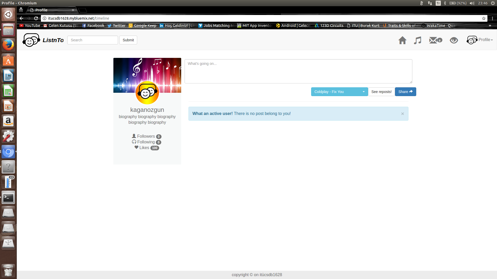
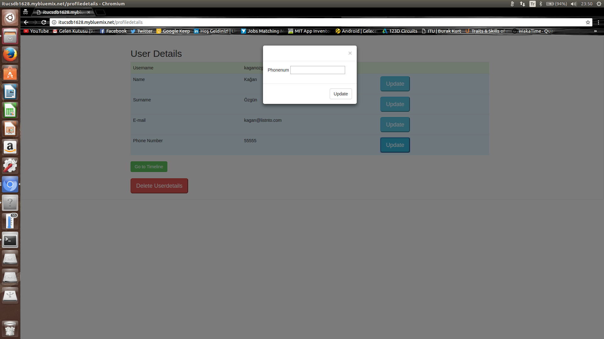

================================
Parts Implemented by Kağan Özgün
================================

.. rubric:: User Guide for Main Page
.. contents:: Contents
   :local:

*************************
General View of Main Page
*************************

* Main page of the application contains 2 button for Sign In and Sign Up operations.

Sign Up
=======
* Sign Up pop-up shown after clicking the Sign Up button in the main page.

* Can be registered on the website after username and password are entered.
* After clicking Sign Up button website render main page again for signing in to website.

Sign In
=======
* Sign In pop-up shown after clicking the Sign In button in the main page.

* Can be signed in to the website after username and password are entered.

* If username and password is correct, website render timeline page.

********************************
General View of the Profile Menu
********************************

* Users can access update profile, delete profile, profile details and logout operations using profile menu.

Update Profile
==============

* Users can access to update profile pop-up using 'Update Profile' button in profile menu.

* Username and password can be changed after the new username and new password entered.

* After clicking the 'Update' button website logout from user timeline and render the main page for signing in with new username and new password.

Delete Profile
==============

* Users can access to delete profile pop-up using 'Delete Profile' button in profile menu.

* Profile of the user can be deleted after the user password entered.
* After clicking the 'Delete' button website delete user profile with all information and render the main page.

Profile Details
===============
* Users can access to profile details page using 'Profile Details' button in profile menu.

Add Profile Details
-------------------
* Add profile details page will open if user information has not been entered previously.

* Profile details can be saved after entering the profile details.

* After adding profile details if user go to profile details page again update and delete details page rendered.

Update Profile Details
----------------------

* Users can update profile details information clicking update button in relevant raw.

* After clicking button pop-up opened and user can enter new information using text-box.

* User can return to Timeline page using 'Go to Timeline' button.

Delete Profile Details
----------------------

* Users can delete all of the their profile details using 'Delete Userdetails' button.

* User password required to delete profile details.

* After deleting the user details timeline page rendered. If user enter the profile details page again, add profile details page rendered.

Logout
======

* User can logout from account using logout button.

* After logout main page rendered for signing in to website again.

***************
Follow/Unfollow
***************

* For follow or unfollow another person, user firstly find person using search bar on the right top of the timeline page.

Follow
======

* After finding person page user can follow person clicking to Follow button on Person's profile card.

* Following number of user is increases after following, it can be shown in user's own profile card which in left side of the timeline page.

Unfollow
========

* For unfollow a person user click unfollow button which is in same location with follow button.

* After unfollowing person user following number decrease and person following number as well.
