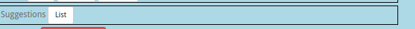

===================================
Parts Implemented by İsmail Pamir
===================================

.. rubric:: User Guide for Post, Like and Suggestion

.. contents:: Contents
   :local:

*****************************
General View of Timeline
*****************************

User with posts
===============

* If a user has posts, these posts will be seen in the user's timeline. As you can see in the screen shot above.

User with no post
===================

   
* If a user has no post, **What an active user!
  There is no post belong to you!** will be displayed. As you can see in the screen shot above.
  
  
*************************************
Searching for Another User's Timeline
*************************************

* A user can search for the user by typing the exact name of another user in the search field where in the 
  navigation bar.
  
  
Searching an Existing User
===============================

.. image:: ../_static/images/post/existinguser.png
   :alt: Searching an Existing User
   :align: center

* If a user with searched user name is found, you are redirected to that user's timeline. Perspective difference in the post
  will be explained in the section of the :ref:`Post_from_different_perspectives`.

Searching non Existing User
================================

* If a user with searched user name is not found, you are redirected to own timeline. As you can see in the screen shot above,
  **Oh snap! User could not be found** will be displayed.

*****************************
Post Operations
*****************************

Sharing Post
==============

* Users can send posts to their timelines by choosing a song.

* Also the user can search songs in the database by typing song name or artist name in the search box.

.. _Post_from_different_perspectives:

Post from Different Perspectives
================================

* User can listen to the shared song by clicking the play button of post.

Current User's Posts
----------------------

* There is like, comment, share, remove, update buttons own post of current user. Because current user can
  remove and update own posts.

Other User's Posts
--------------------

   
* There is no remove and update buttons others post in perspective of current user. Because current user can
  not remove and update others posts.  
   
Updating Post
================
 

 
* User can update own post by clicking update button.
 
 

   
* The post which is pressed its update button opens like shown screen shot above. After user type new text
  to text box, they can update post by clicking update post button.
  
  
Deleting Post
===============

   
* The user can delete own post by clicking remove button.

*****************************
Like Operations
*****************************

   
* There is a like button and like counter belong to each post. 
* Like counter represents that how many people liked that post. 
* This counter is displayed next to like button. 
   
Like a Post
================

* The user can like a post by clicking hearth icon of this post. 
* When user likes a post, heart icon of this post becomes red as you can see in the screen shot below.

Dislike a Post
==============

* The user can dislike a post which is liked already by this user. 
* When user dislikes a post, hearth icon of this post becomes grey again.

*****************************
Suggestion Operations
*****************************

General View of Suggestion Page
================================

   
* There are three input area on this page. One of them is for artist name, other one is for song name
  last one is for released date.
  
Suggesting a Song
=====================  

.. image:: ../_static/images/post/suggesting_song.png
   :alt: Suggesting Song	
   :align: center

* The user may suggest a song to be	added to the site by clicking on the **suggestion button** after 
  filling in these input fields.
  
View your Suggestions
=======================
	

* The user can display own suggestions and their status by clicking **see your suggestion button**. Status will be explained
  on the section of :ref:`Suggestion_status`

Delete your Suggestions
========================

* The user can delete own suggestion by clicking remove button on the see your suggestion page.

.. _Suggestion_status:

Suggestion Status
=====================

* There are three type status of suggestions.
* Statu **"Waiting"** represents that this suggestion is waiting for answer of admin.
* Statu **"Approved"** represents that this suggestion is approved by admin.
* Statu **"Denied"** represents that this suggestion is denied by admin. 

List all Suggestion
===============================

* Admin can see all suggestions by clicking **List button** on the admin panel.

Reject or Approve Suggestion
=================================

* Admin can see all suggestions.
* Admin can approve or reject suggestions.
* There is a tick sign next to the accepted suggestions.
* There is a cross sign next to th rejected suggestions.