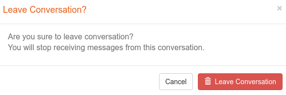
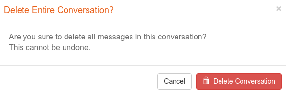

===================================
Parts Implemented by Serkan Suyabak
===================================

.. rubric:: User Guide for Messages Page

.. contents:: Contents
   :local:

*****************************
General View of Messages Page
*****************************

***************
Room Operations
***************

Listing Rooms
=============

* At the left of the room list, we have icon of each message room and right side of it we have room name.
* Under the message room name, we have last message of each room.
* At the rightmost side of the room list, there is a badge that indicates unread message count of each room if room has any unread message.

Searching User
--------------

* When a string searched, rooms that have at least one participant whose name starts with the searched text will be displayed on the list

Creating New Room
=================

* At the starting new conversation popup, there is checkboxes for the all users.
* User should select at least one user to start new conversation.
* Group name is optional. If it is left blank, first 15 characters of concatenation of names of the participants will be shown as group name.

Participants
============

* At the top of the right side of the messages page, there is a header bar.
* In this bar, room name (if it was given), list of room participants and name of the admin of the room are located.
* At the rightmost side, there is a close button.

Updating Room
=============

* Only room admin has right to update the message room.
* At the updating new conversation popup, there is checkboxes for the all users.
* Users can deselect the users that they want to be removed from the room.
* Users can select the users that they want to be added to the room.
* At least one user should be left as selected to update the room.
* Group name is optional.
* Participants that joined or left room, will be shown at the center area of message area as room events. See :ref:`Room_Events`

Leaving Room
============

* If the user wants to leave message room, the confirmation window will be prompt.
* If the user left the room, all messages belong to him/her will be deleted.
* If the admin left the room, next user will be admin.
* If the admin is the only participant in the room (if the other participants left the room), admin can not leave, but delete the room.
* Other participants in the room will see an event information indicates that you left.

Delete Room
===========

* Only the room admin can delete the message room.
* If the room is deleted, all messages and events will be deleted.

******************
Message Operations
******************

Listing Message
===============

* Users may only see messages sent after they have been joined.
* Incoming messages, events and outgoing messages is shown.
* Date information is show up when mouse hover time information under messages or right side of events.

Sending Message
===============

* User may send messages via this textbox under the message area.

.. _Read_Receipts:

Message Status / Read Receipts
==============================

* Users can see their messages whether is read by other participants or not.
* Grey tick sign, under the outgoing message, turns blue when all other participants read this message.

.. _Room_Events:

Room Events
===========

* Users will be informed about room events such as changing in participants or admin user.
* There are only three types of event that indicates one of the three status: left, join or became admin.

********************************
Total Unread Message Count Badge
********************************

* User can see total unread message count on the main navigation bar at the top of the site.
