=======================================
Parts Implemented by Salih Can Yurtkulu
=======================================

.. rubric:: User Guide for Activities Page, Comments, Reposts and Album Operations

.. contents:: Contents
   :local:

*******
Comment
*******

Opening Comment Page
====================
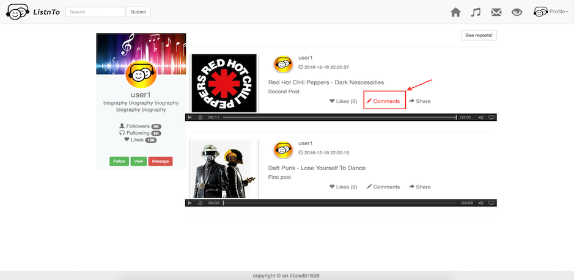

* Users can comment on any post by clicking "Comment" link as shown above.

Commenting on a Post
====================
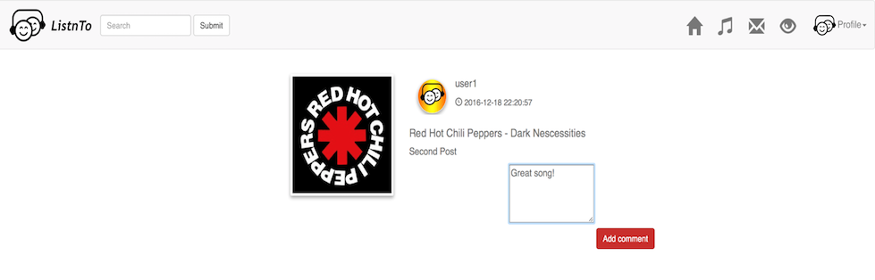

* After clicking "Comment" link comment page will be opened(**shown above**).
* Users can comment on a post.

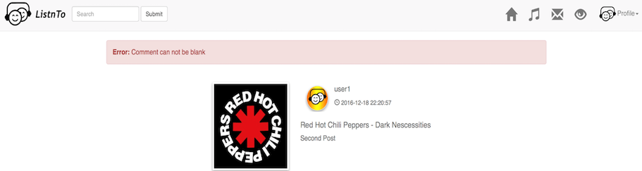

* If blank comment is entered, an **error message** will be printed on the screen.

Deleting and Updating Comments
==============================

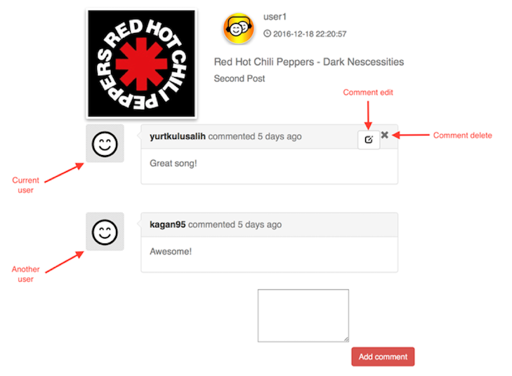

* Only **current user** delete or update her/his own comment.
* If current user wants to delete her/his comment, he/she should click **remove** icon at the right top of the comment box.

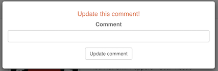

* Comment can be updated by clicking **edit** icon near the remove icon.
* After clicking **edit** icon, a pop-up window will be opened as **shown above**.

******
Repost
******

Sharing a Post
==============

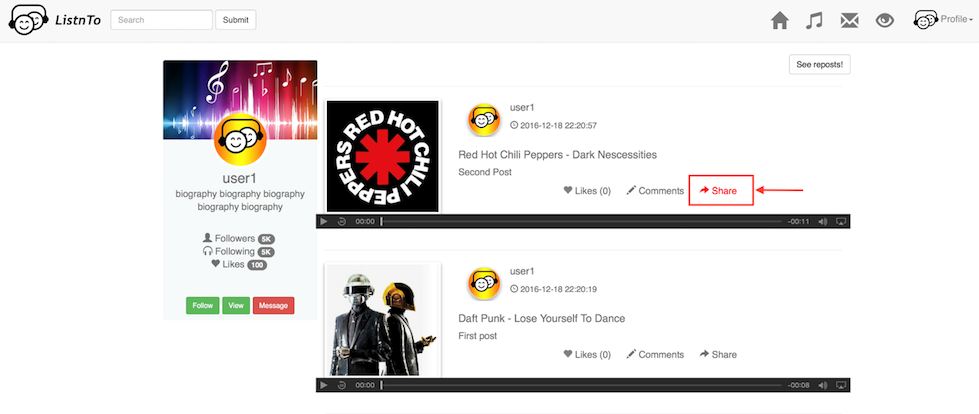

* **Current user** can **share** other user's post by clicking **share** link. Sharing posts also means **reposting**.

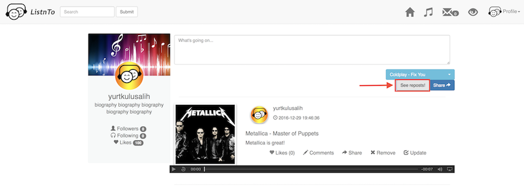

* **Current user** can view his/her own reposts by clicking **"See reposts!"** button.

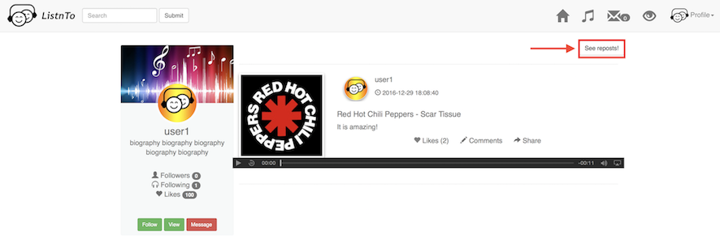

* **Current user** can also view **another user's** reposts as mentioned above.

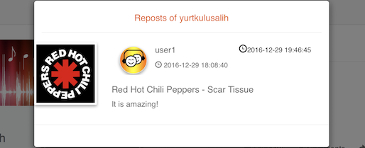

* Repost could be viewed in popups windows, after clicking **"See reposts!"** button.

***************
Activities Page
***************

View Notifications
==================

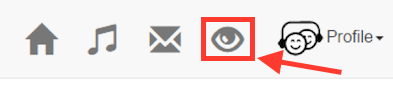

* Users can view their notifications by clicking **"Eye"** button on the menu bar.

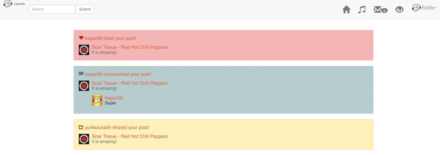

*****
Album
*****

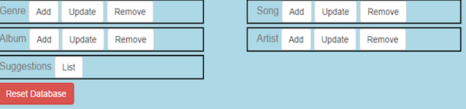

* Only **admin** can add, update and delete albums from **Admin Panel**.

Add Album
=========

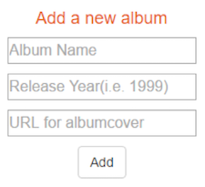

* Admin can **add** a new album by providing an album name, year and album cover URL.

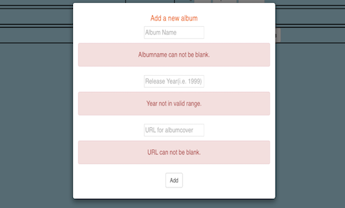

* When inputs are **invalid**, an **error message** is printed.

Update Album
============

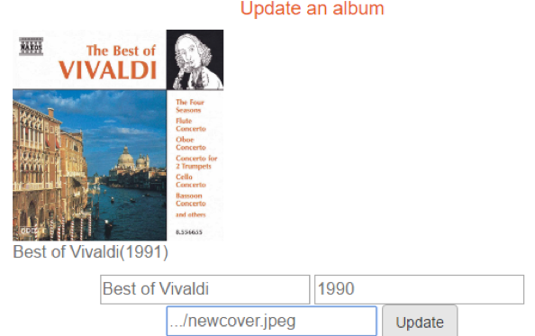

* Admin can **update** listed albums by providing a **new** album name, year and album cover URL.

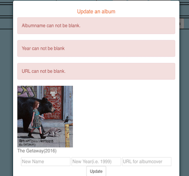

* When inputs are **invalid**, an **error message** for update operation is printed.

Delete Album
============

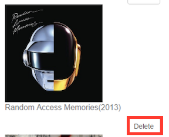

* Admin can **delete** an existing album by clicking **delete** button.