=================================
Parts Implemented by Berkay Giriş
=================================

.. rubric:: User Guide for Navigation Bar, Music Page and Admin Panel

.. contents:: Contents
   :local:

**************
Navigation Bar
**************

General view of Navigation Bar
==============================

From the menu, users can navigate around the website, search users, or do operations with their profile.

Navigation Menu
===============

Users can navigate to 4 different pages as shown.

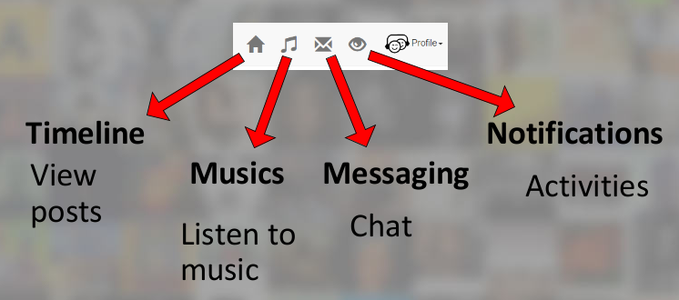

**********
Music Page
**********

General view of Music Page
==========================

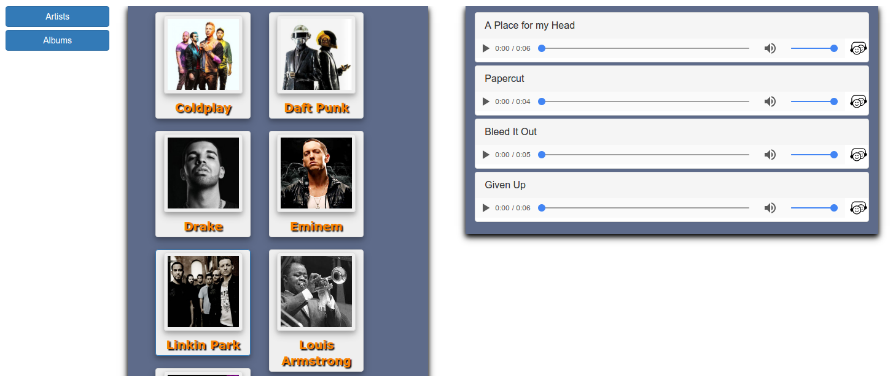

Music page is where users can browse songs, artists and albums.

Browsing artists and albums
===========================

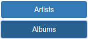

Users can use this menu to browse artists or albums.

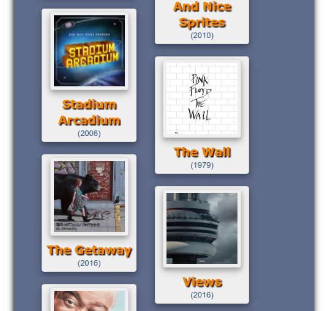

Selected type will be listed in the next container.

Browsing Songs
==============
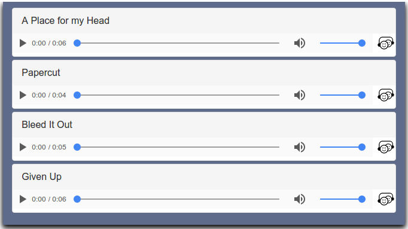

When an artist or an album is selected, their songs will be listed in the rightmost container.

Song Interactions
=================

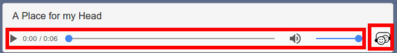

There are two blocks, audio controls and a share button.

Sharing Songs
-------------

When the share button is clicked a pop-up opens.

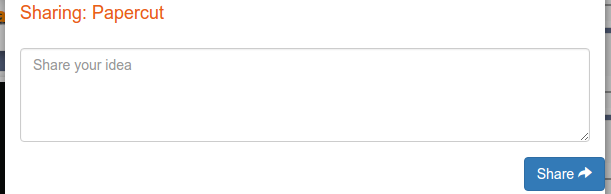

When users complete this operation, a post will be appeared in their pages.

***********
Admin Panel
***********

General view of Admin Panel
===========================

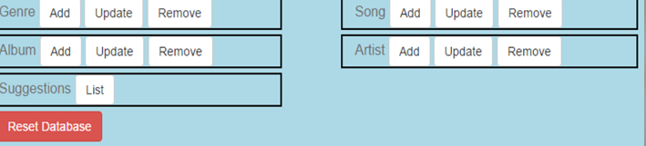

Admins can do add, update and remove operations on Genres, Albums, Artists or Songs; can see suggestions, accept or reject them; or can reset the whole database.

Genre operations
================

Adding Genres
-------------

Admins enter a new genre name to add a genre

Updating Genres
---------------
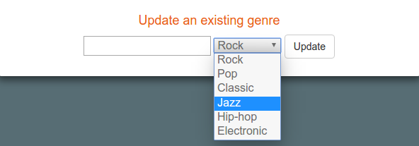

Admins can choose an existing genre and update its name.

Removing Genres
---------------

Admins can remove existing genres.

Artist operations
=================

Adding Artists
--------------
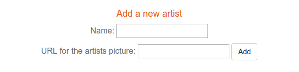

Admins can add new artists by entering their name and picture URLs.

Updating Artists
----------------
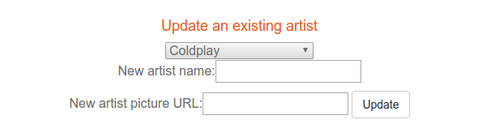

Admins can update the name and the picture of an existing artist.

.. warning:: Both name and picture URL must be entered **again** even if a single value will be changed.

Removing Artists
----------------

Admins can remove existing artists.

Song operations
===============

Adding Songs
------------
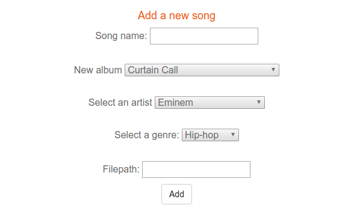

Admins can add new songs by entering a song name, an audio URL and by choosing album, artist and genre information.

.. note::  Artist, album or the genre must be added before adding the song.

Updating Songs
--------------
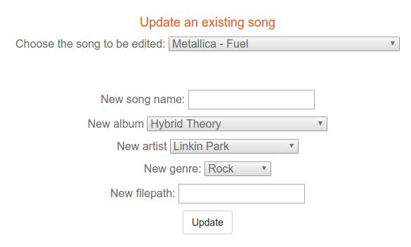

Admins can update song informations.

.. warning:: All values must be entered **again** even if a single value will be changed.

Removing Songs
--------------
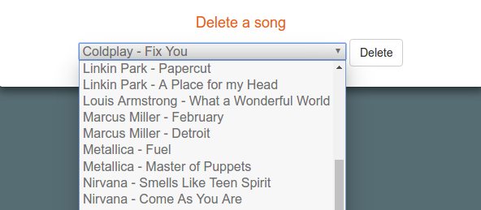

Admins can remove existing songs.
